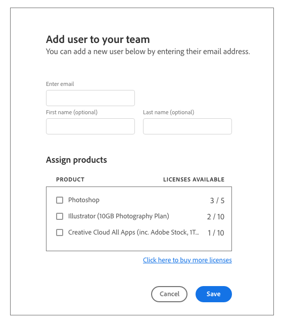

# Specification

## Design Assessment (30 minutes)

You have been given the following XD mockup for a new feature development in a user facing web application.

The Design team have shared these additional insights and requirements:

- The web application is a console used by administrators in larger organisations who use our software, to assign their purchased software licenses to users within their organization.
- The web application is written in React using JavaScript.
- The new feature is a new modal to streamline the process of adding users and assigning products in a single user interface.
- This modal should capture some basic details about the new user, and the administrator can also choose to assign one or more product licenses that should be assigned to that new user when it is created.
- The modal should validate the data entered and send it to the API.
- The validation UX will be provided by the design system in use in the application to maintain consistency.

The modal will be written entirely in React, and a design system and shared component library is already in use in the application. Assuming no other knowledge of the services and capabilities of the application, assess the design and attempt to answer the following questions:

1. What questions do you have about the API requests used to achieve this design?
1. What questions do you have for the Product Owner or Design team about the design provided?
1. What questions do you have for the other engineers who are experienced developing in this application?
1. What concerns or issues would you like to resolve before starting the implementation?

Write down your questions, concerns, and anything else you think you'd need to investigate before starting this implementation.

## Code Assessment (2 - 3 hours)

Implement a simple proof-of-concept for the new modal above using React and React Spectrum components.

This is an opportunity to demonstrate the quality of your code and the breadth of your abilities, and we'd much rather compromise design completeness in favour of seeing some high-quality, well-tested code!

- This repository contains a skeleton application that you can use to host your implementation.
- Your solution will likely make use of the `Dialog`, and `TextField` components from React Spectrum.
- Install ( `npm i` ) and run the application ( `npm run start` ). Your changes to source files will be automatically reflected in the browser.

## Resources

- Adobe Spectrum, our design system: <https://spectrum.adobe.com/>
- React Spectrum, an implementation of Spectrum in React: <https://react-spectrum.adobe.com/react-spectrum/index.html>
- ListView documentation: <https://react-spectrum.adobe.com/react-spectrum/ListView.html>
- TextField documentation: <https://react-spectrum.adobe.com/react-spectrum/TextField.html>
